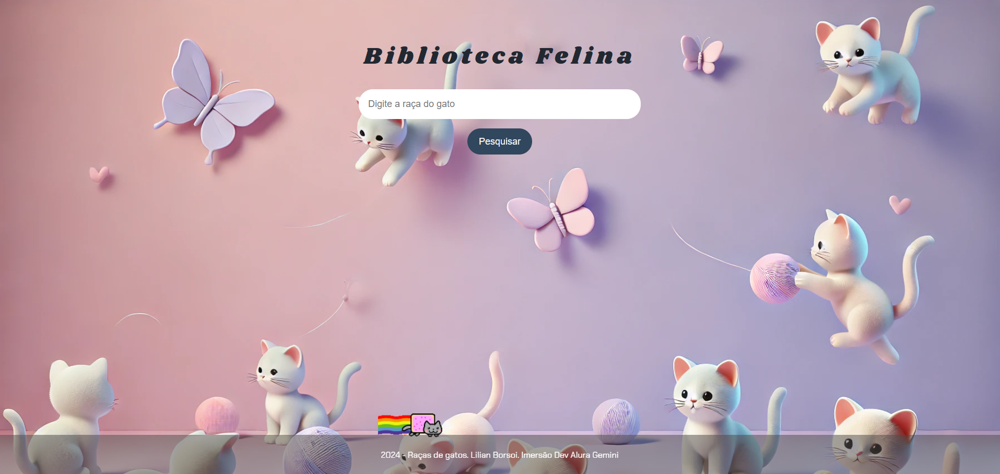

## Biblioteca Felina - Um guia para os amantes de gatos

Este projeto tem como objetivo criar uma página web interativa para amantes de gatos, que permite pesquisar informações sobre diferentes raças felinas. O usuário pode digitar o nome da raça desejada e obter informações detalhadas sobre suas características, pelagem, expectativa de vida e país de origem. 

**Tecnologias Utilizadas:**

* **HTML:** Estrutura da página web.
* **CSS:** Estilização da página web.
* **JavaScript:** Lógica da aplicação, incluindo a funcionalidade de pesquisa.

**Funcionalidades:**

* **Pesquisa por raça:** O usuário pode pesquisar por uma raça específica de gato.
* **Exibição de informações detalhadas:** A página exibe informações detalhadas sobre a raça pesquisada, incluindo:
    * Características
    * Pelagem
    * Expectativa de vida
    * País de origem
* **Links para mais informações:** Um link para a página oficial da raça na Petz é fornecido para acesso a informações mais completas.

**Site**

* **A imagem de background do site foi criada pelo DALL-E 2:**
* **Foto do site:**
   

**Deploy:**

O projeto foi publicado no Vercel: [link da página]((https://bibliotecafelina.vercel.app/))

**Como usar:**

1. Acesse a página da Biblioteca Felina ([link da página](https://biblioteca-felina.vercel.app/)).
2. Digite o nome da raça de gato desejada no campo de pesquisa.
3. Clique no botão "Pesquisar".
4. Os resultados da pesquisa serão exibidos na página.

**Próximos passos:**

* Implementar mais funcionalidades, como:
    * Filtros adicionais para pesquisa (e.g., cor da pelagem, tamanho, etc.)
    * Galeria de fotos de cada raça
* Aprimorar a interface do usuário para uma experiência mais agradável.
* Adicionar informações sobre cuidados com gatos de diferentes raças.

**Contribuições:**

Contribuições são bem-vindas! Você pode contribuir com o projeto:

* Encontrando e reportando bugs.
* Sugerindo novas funcionalidades.
* Enviando código para melhorar o projeto.

**Agradecimentos:**

Agradecemos a todos que contribuíram para este projeto, especialmente à Alura pelo conhecimento compartilhado durante a Imersão Dev Gemini.

